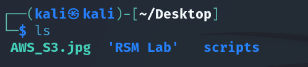
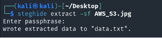
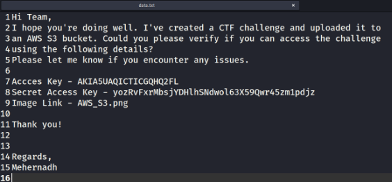
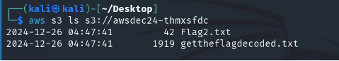
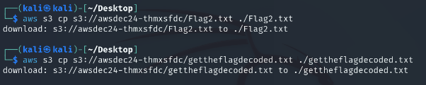
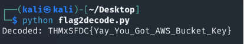

**Prerequisites**

Before diving into the challenge, ensure the following tools are installed on your system:

1. **AWS CLI** – For interacting with AWS services.
1. **ExifTool** – To extract metadata from images.
1. **Steghide** – To analyze and extract hidden data from images.
-----
**Challenge Walkthrough**

**Step 1: Download the JPG File**

The first step involves downloading the provided JPG file from the TryHackMe challenge. Save the file onto your local system or virtual machine for further analysis.

-----
**Step 2: Inspect Metadata of the Image**

Using **ExifTool**, extract the metadata of the downloaded image:

exiftool AWS\_S3.jpg

Carefully review the metadata output. Within the comments section, you will find an **AWS S3 bucket name**. Save this bucket name as it will be essential for accessing data stored in the S3 bucket later.

-----
**Step 3: Search for Hidden Data in the Image**

To check for hidden data in the image, use **Steghide**:

steghide extract -sf challenge.jpg

Since no password is required, the hidden data will be extracted successfully. The extracted file, data.txt, contains the **AWS Access Key** and **AWS Secret Access Key**.

Save these keys as they are required to configure AWS CLI.

-----
**Step 4: Configure AWS CLI**

Use the extracted keys to configure AWS CLI. Run the following command and enter the keys when prompted:

aws configure

-----
**Step 5: List the S3 Bucket Contents**

With AWS CLI configured, access the S3 bucket to view its contents:

aws s3 ls s3://mybucketname

-----
**Step 6: Download the Files**

Download the files from the S3 bucket to your local system:

aws s3 cp s3://mybucketname/flag2.txt ./flag2.txt

aws s3 cp s3://mybucketname/gettheflagdecoded.txt ./gettheflagdecoded.txt

-----
**Step 7: Analyze the Files**

1. **Flag2.txt**: Open flag2.txt, and you will notice that the content is encoded. This requires further decoding to reveal the actual flag.
1. **Gettheflagdecoded.txt**: Open gettheflagdecoded.txt. Carefully review the Python code. It contains logic to decode a flag. Here you will find your **Flag1**.

-----
**Step 8: Create a python file and replace Flag1 Data with Encoded Flag2**

Make a Python file using the code in the gettheflagdecoded.txt.Then replace the data used for Flag1 with the encoded content of flag2.txt. 

-----
**Step 10: Execute the Modified Script**

Run the modified script to decode and extract the second flag:

python suspicious.py

-----
**Conclusion**

Congratulations! You have successfully completed the challenge and retrieved both flags:

1. **Flag 1**: THMxSFDC{ Hurray\_You\_got\_Flag1}
1. **Flag 2**: THMxSFDC{Yay\_You\_Got\_AWS\_Bucket\_Key}

This challenge required a combination of tools and techniques, including metadata analysis, steganography, AWS CLI, and Python scripting.

Happy hacking! 
